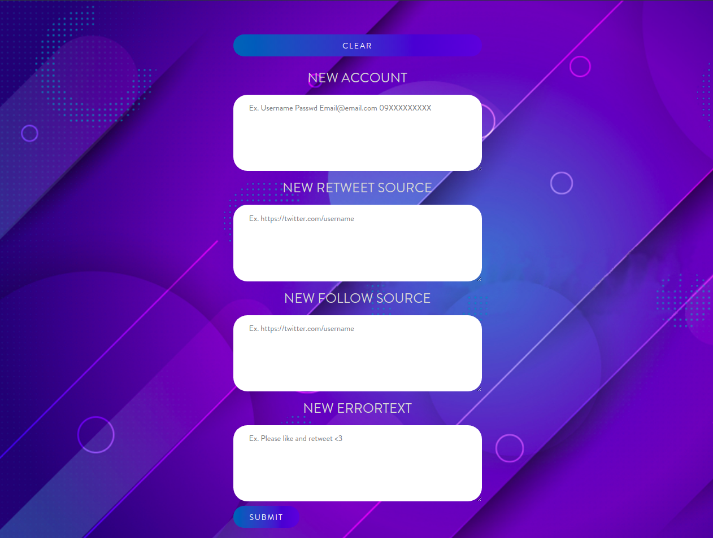

[](https://www.blockchain.com/btc/address/1LQKZHNSzBZeEc7tkdz3McpQkJDsreaHLN)
# TwitterBot
Twitter automated bot, grow fast&easy
# Demo
Here is my Bot-accounts (no human activity included in their whole profile, except BIO,Profile photo)
1. https://twitter.com/shalbaboo
2. https://twitter.com/NotFeri
# Functions
1. Pin Tweet
2. Tweet
3. Retweet
4. Follow
5. Unfollow not followed-back users
# Edit
Be Careful DO NOT FORGET to edit&replace URLs and IDs(for each function) in the code !
# Web Panel
The WebPanel (Apache2 Service)

### Current features
- Add new **Bot** account
- Add **Retweet** source
- Add **Follow** source
- Add **Advertizement** Text
<br>
Sample ScreenShot:


# Disclaimer
*The author is not responsible for any misuse and misbehavior of the contained DATA.*
# Requirements
```
Python 3.8
apt install chromium-chromedriver
cp /usr/lib/chromium-browser/chromedriver /usr/bin
```
### Todo
- [x] Fix errorText
- [x] fix PinTweet